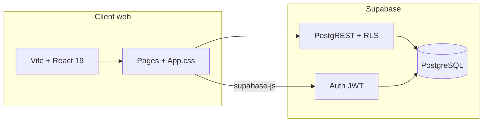

# Documentation technique — SkillSwap (G11)

**Projet :** SkillSwap — plateforme d’échange de compétences entre étudiants et formateurs (campus)  
**Équipe :** G11  
**Dépôt :** `Workshop_agile_scrum-G11`  
**Dernière mise à jour :** juin 2026  

Ce document décrit l’**état réel** de l’application web (`web/`) : stack, structure, flux, base de données et procédures d’exploitation. Il complète les livrables existants (`justification-architecture.md`, `shema mcp_database.md`).

---

## Table des matières

1. [Vue d’ensemble](#1-vue-densemble)
2. [Structure du dépôt](#2-structure-du-dépôt)
3. [Stack technique](#3-stack-technique)
4. [Architecture applicative](#4-architecture-applicative)
5. [Frontend — organisation du code](#5-frontend--organisation-du-code)
6. [Navigation et écrans](#6-navigation-et-écrans)
7. [Authentification](#7-authentification)
8. [Intégration Supabase](#8-intégration-supabase)
9. [Base de données](#9-base-de-données)
10. [Données affichées (mock vs live)](#10-données-affichées-mock-vs-live)
11. [Configuration et variables d’environnement](#11-configuration-et-variables-denvironnement)
12. [Scripts et workflows de développement](#12-scripts-et-workflows-de-développement)
13. [Build et déploiement](#13-build-et-déploiement)
14. [Sécurité](#14-sécurité)
15. [État d’avancement et écarts](#15-état-davancement-et-écarts)
16. [Documents connexes](#16-documents-connexes)

---

## 1. Vue d’ensemble

SkillSwap permet à des **étudiants** et **formateurs** d’un même campus de :

- créer un profil et s’authentifier ;
- rechercher des compétences et des pairs ;
- organiser ou rejoindre des **sessions** d’apprentissage ;
- échanger via **messagerie** et **contacts** ;
- progresser via **XP**, **niveaux** et **badges**.

L’application suit une architecture **découplée** : le client web (React) consomme **Supabase** (PostgreSQL, Auth, RLS) sans serveur applicatif dédié maintenu par l’équipe. Voir `justification-architecture.md` pour la justification des choix.



---

## 2. Structure du dépôt

```
Workshop_agile_scrum-G11/
├── Docs/                          # Documentation projet (ce fichier, MPD, architecture…)
├── image figma/                   # Exports maquettes
└── web/                           # Application frontend + Supabase local
    ├── public/                    # Assets statiques (favicon, icons.svg)
    ├── src/
    │   ├── App.tsx                # Routage par état (views)
    │   ├── App.css                # Styles globaux de l’app
    │   ├── main.tsx               # Point d’entrée React
    │   ├── index.css              # Reset / variables de base
    │   ├── lib/
    │   │   └── supabaseClient.ts  # Client Supabase unique
    │   ├── data/
    │   │   └── skillSwapData.ts   # Données mock du tableau de bord
    │   ├── shared/
    │   │   └── IonIcon.tsx        # Wrapper ion-icon
    │   ├── registerIonIcons.ts    # Enregistrement tree-shake des icônes
    │   ├── assets/                # Images (logo, hero, backgrounds)
    │   └── pages/
    │       ├── landing/           # Page marketing
    │       ├── auth/              # Connexion / inscription
    │       └── dashboard/         # Espace connecté
    ├── supabase/
    │   ├── config.toml            # Config CLI Supabase
    │   └── migrations/            # Schéma SQL + RLS + triggers
    ├── index.html
    ├── vite.config.ts
    ├── package.json
    └── .env                       # Variables locales (non versionné)
```

---

## 3. Stack technique

| Couche | Technologie | Version (indicative) |
|--------|-------------|----------------------|
| Runtime build | **Vite** | ^8.x |
| UI | **React** | ^19.x |
| Langage | **TypeScript** | ~6.x |
| Backend managé | **Supabase** (`@supabase/supabase-js`) | ^2.x |
| Icônes | **Ionicons** (custom elements) | ^8.x |
| Styles | **CSS custom** (`App.css`, `index.css`) | — |
| Lint | ESLint + typescript-eslint | — |

**Non utilisés dans le code actuel** (prévus dans `justification-architecture.md`) : shadcn/ui, Tailwind CSS, React Router, TanStack Query.

---

## 4. Architecture applicative

### 4.1 Routage

Il n’y a **pas** de `react-router`. La navigation est gérée par un **état local** dans `App.tsx` :

```typescript
type AppView = 'landing' | 'sign-in' | 'sign-up' | 'dashboard'
```

| Vue | Composant | Condition d’affichage |
|-----|-----------|------------------------|
| `landing` | `LandingPage` | Utilisateur non connecté, vue par défaut |
| `sign-in` / `sign-up` | `AuthPage` | Navigation depuis la landing ou bascule auth |
| `dashboard` | `DashboardPage` | Session Supabase active |

Le tableau de bord utilise un second état `activeSectionId` (`DashboardSectionId`) pour changer de section sans changer d’URL.

### 4.2 Cycle de vie de la session

1. Au montage, `supabase.auth.getSession()` détermine si l’utilisateur va directement au dashboard.
2. `onAuthStateChange` redirige vers le dashboard si une session apparaît.
3. `handleSignOut()` appelle `signOut()` puis repasse la vue à `landing`.

### 4.3 Point d’entrée

`main.tsx` :

- charge `registerIonIcons` (tree-shaking des icônes) ;
- appelle `defineCustomElements(window)` pour Ionicons ;
- monte `<App />` sous `StrictMode`.

---

## 5. Frontend — organisation du code

### 5.1 Client Supabase

Fichier unique : `src/lib/supabaseClient.ts`.

- Lit `VITE_SUPABASE_URL` et `VITE_SUPABASE_ANON_KEY`.
- Lance une erreur au démarrage si les variables manquent.
- Export : `supabase` (instance `createClient`).

**Règle :** ne jamais y placer la clé `service_role`.

### 5.2 Icônes

- `registerIonIcons.ts` : `addIcons({ ... })` avec imports nommés depuis `ionicons/icons`.
- `IonIcon.tsx` : rendu `<ion-icon name="…" />` via `createElement`.
- `vite.config.ts` : `optimizeDeps.exclude: ['ionicons']` pour éviter des problèmes de pré-bundle.

### 5.3 Styles

- `index.css` : fondations globales.
- `App.css` : styles landing, auth, dashboard (layout sidebar, cartes, sheets, responsive).

Les maquettes Figma sont dans `image figma/` et `Docs/MAQUETTES SKILLSWAP.fig`.

---

## 6. Navigation et écrans

### 6.1 Landing (`LandingPage.tsx`)

Page marketing statique :

- navigation ancres (`#home`, `#discover`, …) ;
- CTA vers `sign-in` / `sign-up` via `onNavigate` ;
- sections : hero, statistiques, « comment ça marche », footer.

### 6.2 Authentification (`AuthPage.tsx`)

- Modes : `sign-in` | `sign-up` (prop `authMode`).
- Formulaire : email, mot de passe ; inscription + prénom / nom.
- Intégration Supabase Auth (voir §7).
- Panneau latéral brand + témoignage (contenu statique).

### 6.3 Tableau de bord (`DashboardPage.tsx`)

Layout en trois zones :

| Zone | Fichier | Rôle |
|------|---------|------|
| Sidebar | `AppSidebar.tsx` | Menu sections, déconnexion |
| Centre | `DashboardContent.tsx` | Contenu selon `activeSectionId` |
| Droite | `DashboardRightPanel.tsx` | Panneau latéral (vue `overview` uniquement) |
| Header | `AppHeader.tsx` | Recherche, ouverture sheets |
| Overlays | `DashboardSheets.tsx` | Messages / notifications en sheet |

**Sections** (`DashboardSectionId` dans `skillSwapData.ts`) :

| ID | Libellé UI |
|----|------------|
| `overview` | Tableau de bord |
| `search` | Recherche |
| `sessions` | Mes sessions |
| `skills` | Mes compétences |
| `messages` | Messages |
| `notifications` | Notifications |
| `feed` | Feed social |
| `badges` | Badges |
| `friends` | Mon profil |
| `settings` | Paramètres |

La section `overview` affiche sessions à venir, compétences populaires, activités récentes et statistiques à partir des **données mock** (§10).

---

## 7. Authentification

### 7.1 Flux implémentés

| Action | API | Fichier |
|--------|-----|---------|
| Connexion | `signInWithPassword({ email, password })` | `AuthPage.tsx` |
| Inscription | `signUp({ email, password, options: { data: { first_name, last_name } } })` | `AuthPage.tsx` |
| Session initiale | `getSession()` | `App.tsx` |
| Écoute session | `onAuthStateChange` | `App.tsx` |
| Déconnexion | `signOut()` | `App.tsx` → `DashboardPage` |

### 7.2 Comportements

- **Inscription avec confirmation email** : si Supabase ne renvoie pas de `session` immédiate, un message invite à confirmer l’email avant connexion.
- **Mot de passe oublié** : bouton présent en UI, **non branché** à `resetPasswordForEmail`.
- **Profil `public.users`** : le schéma DB prévoit une ligne liée à `auth.users`, mais l’inscription front **n’insère pas encore** dans `users` (à faire via trigger Supabase ou insert post-signup).

### 7.3 Métadonnées Auth

Prénom et nom sont stockés dans `user_metadata` à l’inscription. Les **droits métier** (`account_type`, etc.) doivent rester dans la table `public.users`, pas dans `user_metadata` (modifiable côté client).

---

## 8. Intégration Supabase

### 8.1 Appels actuels depuis le frontend

| Domaine | Statut |
|---------|--------|
| Auth (sign-in, sign-up, sign-out, session) | **Implémenté** |
| CRUD tables (`from('users')`, sessions, …) | **Non implémenté** dans `src/` |
| Edge Functions | **Non présentes** dans le dépôt |
| Realtime | **Non utilisé** |

### 8.2 Évolution prévue (architecture cible)

Documentée dans `justification-architecture.md` :

- lectures/écritures via `supabase.from('<table>')` soumises au **RLS** ;
- logique complexe (matching, XP, badges) via **Edge Functions** ;
- optionnel : Realtime pour inscriptions / messagerie.

Exemple cible (création de session) :

```typescript
const { data, error } = await supabase
  .from('sessions')
  .insert({
    title: 'Initiation React',
    type: 'Cours rapide',
    scheduled_at: '2026-06-15T18:00:00Z',
    location: 'Salle B12',
    skill_id: 3,
    host_id: user.id,
    max_participants: 8,
    description: '…',
  })
  .select()
  .single()
```

---

## 9. Base de données

### 9.1 Migration

Fichier : `web/supabase/migrations/20260602154716_setup_skillswap_database.sql`

Contenu principal :

- **Enums** : `account_type`, `skill_level`, `user_skill_role`, `session_status`, `session_type`, `contact_request_status`
- **Tables métier** : `users`, `skills`, `user_skills`, `sessions`, `session_co_hosts`, `session_registrations`, `badges`, `user_badges`, `feedbacks`, `contact_requests`, `user_contacts`, `user_blocks`, `conversations`, `conversation_participants`, `messages`
- **Schéma privé** `app_private` : fonctions triggers (niveau XP, validations session, contacts, messages)
- **RLS** activé sur toutes les tables `public` avec policies par rôle `authenticated`

### 9.2 Règle XP / niveaux (implémentée en base)

Trigger `sync_user_level_from_experience` sur `users` :

- niveau 1 à 0 XP ;
- pour passer du niveau `n` à `n+1`, il faut `n * 500` XP supplémentaires (500, puis 1000, puis 1500, …).

Fonction : `app_private.skill_swap_level_for_experience(total_experience)`.

### 9.3 Contraintes métier (triggers)

| Règle | Mécanisme |
|-------|-----------|
| Hôte ≠ co-présentateur ≠ inscrit apprenant (même session) | `validate_session_co_host`, `validate_session_registration` |
| Co-présentateur = formateur uniquement | `validate_session_co_host` |
| Session pleine | `validate_session_registration` |
| Contact après acceptation invitation | `create_contacts_after_request_acceptance` |
| Blocage supprime contacts | `remove_contacts_after_block` |
| Message : expéditeur participant, pas de blocage | `validate_message_sender` |

### 9.4 Politiques RLS (résumé)

| Table | Lecture | Écriture typique |
|-------|---------|------------------|
| `users` | Tous les authentifiés | Insert/update **propre** `id = auth.uid()` |
| `skills`, `user_skills` | Authentifiés | `user_skills` : gestion **propre** |
| `sessions` | Authentifiés | Insert/update si `host_id = auth.uid()` |
| `session_registrations` | Authentifiés | Insert/delete **propre** |
| `contact_requests` | Parties impliquées | Insert expéditeur ; update destinataire |
| `messages` | Participants conversation | Insert si `sender = auth.uid()` |

Schéma détaillé et user stories : `shema mcp_database.md`.

---

## 10. Données affichées (mock vs live)

Le fichier `src/data/skillSwapData.ts` centralise des **données statiques** pour le prototype UI :

- `currentUser` (profil, XP, avatar) ;
- `navigationSections`, `upcomingSessions`, `popularSkills`, `statistics` ;
- `messages`, `notifications`, `badges`, `recentActivities`, etc.

**Conséquence :** après connexion Supabase, le dashboard affiche encore le profil **Sarah Martin** (mock), pas l’utilisateur connecté ni les données Postgres.

**Prochaine étape technique recommandée :**

1. Créer / synchroniser `public.users` à l’inscription (trigger ou RPC).
2. Remplacer progressivement les imports depuis `skillSwapData.ts` par des requêtes `supabase.from(...)`.
3. Typer les réponses (génération de types depuis le schéma Supabase).

---

## 11. Configuration et variables d’environnement

### 11.1 Fichier `.env` (dans `web/`, local uniquement)

| Variable | Description |
|----------|-------------|
| `VITE_SUPABASE_URL` | URL du projet Supabase (ex. `https://<ref>.supabase.co`) |
| `VITE_SUPABASE_ANON_KEY` | Clé **anon / publishable** (client public) |

Les variables préfixées `VITE_` sont exposées au bundle front par Vite. Ne jamais y mettre `service_role`.

Types déclarés dans `src/vite-env.d.ts`.

### 11.2 Supabase CLI (local)

- Config : `web/supabase/config.toml`
- Appliquer les migrations : depuis `web/`, avec la [CLI Supabase](https://supabase.com/docs/guides/cli) (`supabase db push` ou `supabase migration up` selon l’environnement).

---

## 12. Scripts et workflows de développement

Depuis le répertoire `web/` :

| Commande | Description |
|----------|-------------|
| `npm install` | Installer les dépendances |
| `npm run dev` | Serveur de développement Vite (HMR) |
| `npm run build` | `tsc -b` puis build de production |
| `npm run preview` | Prévisualiser le build |
| `npm run lint` | ESLint sur le projet |

### Prérequis

- **Node.js** 18+ (recommandé 20+)
- Compte / projet **Supabase** avec Auth email activé
- Fichier `.env` renseigné

### Workflow type

1. Cloner le dépôt.
2. `cd web && npm install`
3. Créer `web/.env` avec les clés Supabase.
4. Appliquer la migration sur le projet Supabase.
5. `npm run dev` → ouvrir l’URL affichée par Vite (souvent `http://localhost:5173`).

---

## 13. Build et déploiement

### 13.1 Build de production

```bash
cd web
npm run build
```

Sortie : `web/dist/` (assets statiques + JS/CSS hashés).

### 13.2 Hébergement frontend

Options compatibles avec Vite :

- **Vercel**, **Netlify**, **Cloudflare Pages** : racine du site = `web`, commande build = `npm run build`, répertoire de sortie = `dist`.
- Définir les variables `VITE_SUPABASE_*` dans l’interface d’hébergement (environnement Production / Preview).

### 13.3 Supabase

- Hébergement DB + Auth géré par Supabase.
- Configurer les **URL de redirection** Auth (Site URL, redirect URLs) pour inclure le domaine de production et `http://localhost:5173` en dev.

### 13.4 CORS

Le client Supabase communique en HTTPS vers l’API Supabase ; pas de configuration CORS custom côté équipe pour le CRUD standard.

---

## 14. Sécurité

| Pratique | Statut projet |
|----------|----------------|
| Clé anon uniquement dans le client | Oui (`supabaseClient.ts`) |
| RLS sur toutes les tables public | Oui (migration) |
| `account_type` et droits en table `users`, pas dans `user_metadata` | Schéma OK ; à respecter côté app |
| Validation règles session / contacts en base | Triggers `app_private` |
| `.env` dans `.gitignore` | Vérifier avant tout commit |

**À ne pas faire :** exposer `service_role`, désactiver RLS en production, autoriser des updates basés uniquement sur `user_metadata`.

---

## 15. État d’avancement et écarts

| Fonctionnalité | UI | Données live | Backend |
|----------------|----|--------------|---------|
| Landing | Oui | N/A | N/A |
| Auth email / mot de passe | Oui | Partiel (Auth seulement) | Supabase Auth |
| Dashboard multi-sections | Oui | Non (mock) | Schéma prêt |
| Création profil `users` post-signup | Non | Non | À brancher |
| Sessions / inscriptions | Placeholder | Non | RLS + triggers prêts |
| Messagerie / contacts | Placeholder / sheets | Non | Tables + RLS prêts |
| Gamification (XP, badges) | Affichage mock | Non | Trigger niveau en base |
| Edge Functions (matching, award XP) | Non | Non | Prévu architecture |

**Écart documentation / code :** `justification-architecture.md` mentionne React + shadcn + Tailwind ; l’implémentation actuelle utilise **CSS custom** et **Ionicons** sans shadcn.

---

## 16. Documents connexes

| Document | Contenu |
|----------|---------|
| `Docs/justification-architecture.md` | Choix stack, découplage, mobile-ready, Edge Functions cibles |
| `Docs/shema mcp_database.md` | MPD, user stories, règles formateurs |
| `Docs/fiche-analyse-besoins-competences.md` | Besoins compétences équipe |
| `Docs/shema mcp_database.md` | Schéma relationnel détaillé |
| `web/supabase/migrations/20260602154716_setup_skillswap_database.sql` | Source de vérité SQL |
| `web/README.md` | Template Vite par défaut |

---

## Annexe A — Arborescence `src/pages/dashboard`

```
dashboard/
├── DashboardPage.tsx      # Layout principal
├── AppSidebar.tsx         # Navigation + logout
├── AppHeader.tsx          # Barre supérieure
├── DashboardContent.tsx   # Sections + overview
├── DashboardRightPanel.tsx
└── DashboardSheets.tsx    # Panneaux messages / notifications
```

## Annexe B — Types exportés (`skillSwapData.ts`)

```typescript
export type DashboardSectionId =
  | 'overview' | 'search' | 'sessions' | 'skills'
  | 'messages' | 'notifications' | 'feed' | 'badges'
  | 'settings' | 'friends'
```

---

*Document rédigé pour le livrable « documentation technique d’usage » — reflète le code du dépôt `web/` à la date de rédaction.*
