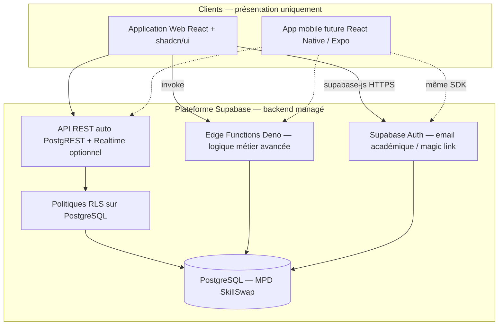
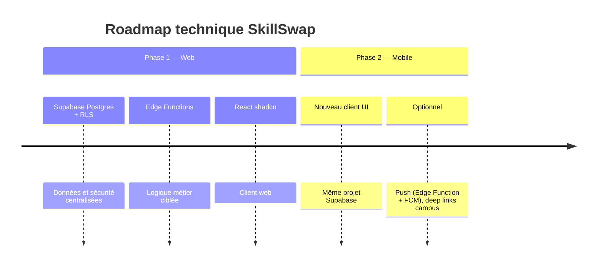

# Justification d'architecture — SkillSwap

**Document :** note technique pour le jury  
**Projet :** SkillSwap — échange de compétences entre étudiants  
**Équipe :** G11  
**Objectif :** expliquer et justifier les choix technologiques, en particulier une architecture **découplée** et **évolutive vers le mobile**, **sans serveur applicatif dédié** à maintenir par l’équipe.

---

## 1. Contexte et contrainte du brief

Le sujet du workshop impose que SkillSwap soit :

- conçu **dès l’origine** pour évoluer vers une **application mobile** ;
- fondé sur une **architecture découplée** et des choix technologiques **justifiés** dans les livrables.

Notre groupe retient une stack **moderne, orientée API et mobile**, adaptée au délai du workshop (3 jours) : **React + shadcn** côté interface, **Supabase** côté données, auth et logique serveur légère.

**Décision structurante :** pas de backend monolithique à déployer et maintenir par l’équipe. La **plateforme Supabase** joue le rôle d’infrastructure backend managée ; le **frontend** reste un client interchangeable (web aujourd’hui, mobile demain).

---

## 2. Principes directeurs retenus

| Principe | Application sur SkillSwap |
|----------|---------------------------|
| **Pas de back « maison »** | Aucun serveur applicatif dédié à l’équipe ; Supabase héberge Postgres, Auth et Edge Functions. |
| **Données et sécurité côté plateforme** | Schéma PostgreSQL + **RLS** (Row Level Security) : chaque étudiant n’accède qu’à ce qu’il a le droit de voir. |
| **Logique métier ciblée** | CRUD simple via l’API auto-générée Supabase ; règles complexes (matching, points, badges) via **Edge Functions** ou SQL (triggers / RPC). |
| **Client unique pour le web** | React + shadcn consomme Supabase via `@supabase/supabase-js` — **un seul point d’accès** (`lib/supabase.ts`). |
| **Mobile-first (UI)** | Composants shadcn + Tailwind responsive ; futur client mobile réutilise **le même projet Supabase**. |
| **Évolutivité** | Web et mobile = **deux interfaces**, **une même base**, **mêmes règles** (RLS + Edge Functions). |

---

## 3. Vue d’ensemble de l’architecture



**Lecture pour le jury :** nous n’avons **pas** « zéro backend » — nous avons **zéro serveur à déployer nous-mêmes**. Le découplage est réel : l’UI ne contient ni SQL ni secrets serveur ; la **plateforme** centralise données, auth et règles.

---

## 4. Stack technique retenue

### 4.1 Frontend — React + TypeScript + shadcn/ui

| Élément | Choix | Justification |
|---------|--------|---------------|
| Framework UI | **React** | Composants réutilisables ; aligné avec **React Native / Expo** pour la phase mobile. |
| Langage | **TypeScript** | Types partagés avec les tables Supabase (génération de types depuis le schéma). |
| Composants | **shadcn/ui** | Design system accessible (Radix), copié dans le repo, style aligné sur la doc officielle. |
| Styles | **Tailwind CSS** | Mobile-first, cohérent avec shadcn. |
| Données | **@supabase/supabase-js** + **TanStack Query** (recommandé) | Accès typé aux tables, auth, appels Edge Functions ; cache et états UI. |

### 4.2 Plateforme — Supabase

| Service Supabase | Rôle sur SkillSwap |
|------------------|-------------------|
| **PostgreSQL** | Héberge le MPD (users, skills, sessions, badges, feedbacks). Enums Postgres pour `skill_level`, `session_status`, etc. |
| **Supabase Auth** | Inscription / connexion (email académique, validation de domaine si besoin). JWT géré par Supabase. |
| **API auto (PostgREST)** | Exposition REST des tables filtrées par **RLS** — pas d’API à coder à la main pour le CRUD. |
| **RLS** | Autorisation fine : un étudiant lit les profils publics, modifie uniquement le sien, s’inscrit aux sessions selon les règles définies. |
| **Edge Functions** | Logique serveur courte (Deno/TypeScript) : matching, attribution de points/badges, validations multi-tables, envoi d’emails optionnel. |
| **Storage** (optionnel) | Avatars, icônes de badges (`icon_url`). |
| **Realtime** (optionnel) | Mise à jour live des inscriptions à une session ou du feed. |

**Pourquoi Supabase pour SkillSwap ?**

| Critère | Apport |
|---------|--------|
| Mise en place (workshop) | Projet + migrations + policies, sans serveur à provisionner |
| Déploiement | Plateforme managée, hébergement simplifié |
| API pour le mobile | REST auto-générée + **SDK identique** web et mobile |
| Auth + JWT | **Intégrés** (email académique, sessions) |
| Sécurité données | **RLS au niveau Postgres** (défense en profondeur) |

Le sujet demande une **base de données** et une **intégration technique** : Supabase répond aux deux, avec une trajectoire mobile **native** via le SDK officiel.

### 4.3 Répartition des responsabilités (sans back « maison »)

| Besoin | Où ça vit | Exemple SkillSwap |
|--------|-----------|-------------------|
| Lire / écrire des lignes autorisées | **Client + RLS** | Liste des compétences, mise à jour de son profil |
| Règles d’accès par utilisateur | **Politiques RLS** | Seul l’hôte peut modifier sa session |
| Calculs, agrégations, workflows | **Edge Function** ou **RPC SQL** | Suggestions de matching, +10 points après session |
| Authentification | **Supabase Auth** | Connexion email campus |
| Fichiers | **Supabase Storage** | Photo de profil, badge |

> **Règle d’équipe :** le frontend **ne contient jamais** la clé `service_role`. Seule la clé **publishable** (ex-anon) est dans le client ; les Edge Functions utilisent le contexte auth de l’utilisateur ou la clé service **côté serveur Supabase uniquement**.

---

## 5. Découplage et stratégie mobile

### 5.1 Ce que fait le frontend (client)

- UI : écrans profil, recherche, sessions, gamification, feedbacks (shadcn).
- Appels `supabase.from('sessions').select(...)` pour les lectures/écritures autorisées par RLS.
- `supabase.functions.invoke('match-students', { body })` pour la logique métier complexe.
- Gestion de session auth (`getSession`, `onAuthStateChange`).

### 5.2 Ce que fait la plateforme Supabase (backend managé)

- Persistance PostgreSQL et intégrité référentielle.
- Vérification **JWT** à chaque requête API.
- Application des **politiques RLS** (impossible de contourner depuis le client sans token valide).
- Exécution des **Edge Functions** pour les traitements qui ne doivent pas être dupliqués dans chaque client.

### 5.3 Exemple de flux (création de session)

```typescript
// 1. Client — insertion autorisée si RLS : host_id = auth.uid()
const { data, error } = await supabase
  .from('sessions')
  .insert({
    title: 'Initiation React',
    type: 'Cours rapide',
    scheduled_at: '2026-06-15T18:00:00',
    location: 'Salle B12',
    skill_id: 3,
    host_id: user.id,
    max_participants: 8,
  })
  .select()
  .single();

// 2. Edge Function (optionnel) — notification ou validation métier
await supabase.functions.invoke('notify-session-created', {
  body: { sessionId: data.id },
});
```

Le site web et une future app mobile exécutent **le même code d’intégration** (SDK Supabase) ; seul le rendu UI change.

### 5.4 Bénéfices pour le jury

| Bénéfice | Détail |
|----------|--------|
| **Backend managé** | L’équipe se concentre sur le produit, pas sur l’infra serveur |
| **API sans développement manuel** | PostgREST + RLS pour le CRUD ; Edge Functions pour le métier avancé |
| **Auth intégrée** | JWT et sessions gérés par Supabase |
| **Mobile-ready** | Futur client = **même SDK**, mêmes policies RLS |

**Découplage préservé :** la couche présentation (React) est séparée de la couche données/sécurité (Supabase). L’UI ne duplique pas la logique métier ni l’accès direct à la base.

---

## 6. Edge Functions — notre « logique serveur » ponctuelle

Les **Edge Functions** portent la logique serveur pour les cas où le client ne doit pas tout faire seul.

| Fonction (exemple) | Déclencheur | Rôle |
|------------------|-------------|------|
| `match-students` | Recherche de binômes | Algorithme de matching selon compétences / niveaux / dispos |
| `award-session-points` | Fin de session | Mise à jour `points`, déblocage badge |
| `register-to-session` | Inscription | Vérifier `max_participants`, éviter les doublons |
| `validate-academic-email` | Inscription | Restreindre au domaine `@ecole.fr` (si configuré) |

**Avantages pour SkillSwap :**

- Code **TypeScript** (comme le front) — une seule langue dans l’équipe.
- Déployées avec `supabase functions deploy`, sans serveur VPS.
- Exécutées **près de l’utilisateur** (edge) — latence réduite pour le campus.
- **Secrets** (clés API tierces) stockés côté Supabase, jamais dans le repo front.

**Quand ne pas utiliser une Edge Function ?**  
Si une règle peut être exprimée en **RLS** ou en **trigger PostgreSQL** (ex. `updated_at`, compteur d’inscriptions), on privilégie la base — moins de code à maintenir.

---

## 7. Sécurité — RLS et bonnes pratiques

Conformément aux bonnes pratiques Supabase :

1. **RLS activé** sur toutes les tables du schéma `public`.
2. Politiques explicites : `SELECT` / `INSERT` / `UPDATE` / `DELETE` selon `auth.uid()`.
3. **Ne jamais** baser l’autorisation sur `user_metadata` (modifiable par l’utilisateur) ; profils et rôles dans des **tables applicatives** liées à `auth.users`.
4. Clé **publishable** uniquement dans le frontend ; `service_role` réservée aux Edge Functions si nécessaire.
5. **UPDATE** : penser à une policy `SELECT` associée (sinon les updates échouent silencieusement sous RLS).

Exemple de intention (schéma simplifié) :

```sql
-- Un étudiant ne modifie que son propre profil
CREATE POLICY "users_update_own"
  ON public.profiles FOR UPDATE
  USING (auth.uid() = id);
```

---

## 8. shadcn/ui — design system et cohérence visuelle

Nous utilisons **shadcn/ui** comme catalogue de composants (`components/ui/`), en nous inspirant des **exemples officiels** pour le style et les interactions.

| Fonctionnalité SkillSwap | Composants shadcn | Rôle |
|--------------------------|-------------------|------|
| Inscription / connexion | `Form`, `Input`, `Button` | Email académique via Supabase Auth |
| Profil étudiant | `Card`, `Avatar`, `Badge`, `Textarea` | Compétences, niveaux, disponibilités |
| Recherche / matching | `Command`, `Select`, `Tabs` | Filtres ; résultats issus de Supabase |
| Création de session | `Dialog` / `Sheet`, `Calendar` | Insert `sessions` + RLS |
| Liste des sessions | `Card`, `Badge` | Statuts planifiée / en cours / terminée |
| Gamification | `Badge`, `Progress` | Points et badges (`user_badges`) |
| Feed / feedback | `Card`, `Textarea` | Table `feedbacks` |
| Navigation mobile | `Sheet`, `NavigationMenu` | UX au pouce |

### Structure front (simplifié)

```
src/
├── components/ui/       # shadcn
├── features/
│   ├── auth/
│   ├── profile/
│   ├── sessions/
│   └── matching/
├── lib/
│   └── supabase.ts      # Client Supabase — seul point d’accès données
└── App.tsx

supabase/
├── migrations/            # Schéma MPD + RLS
└── functions/             # Edge Functions (matching, points, …)
```

---

## 9. Chemin d’évolution vers l’application mobile

### Phase 1 — Workshop (web)

- React + shadcn, responsive.
- Schéma Postgres (MPD) + policies RLS.
- Auth Supabase opérationnelle.
- Edge Functions pour matching et gamification.

### Phase 2 — Application mobile

| Option | Lien avec Supabase |
|--------|-------------------|
| **React Native / Expo** | Même package `@supabase/supabase-js`, mêmes appels, mêmes RLS |
| **Flutter** | Client `supabase-flutter` sur le **même projet** |
| **PWA** | Site installable ; auth et API inchangés |



**Message jury :** la migration mobile ne nécessite **ni réécriture de l’API ni refonte des données** — uniquement un nouveau client et les ajustements UX (notifications, navigation native).

---

## 10. Alignement avec le MPD

- Le **MPD relationnel** (cf. `Docs/shema mcp_database.md`) est implémenté en **migrations Supabase** (PostgreSQL).
- Les enums du MPD deviennent des **types ENUM Postgres** ou des `CHECK` constraints.
- `auth.users` (Supabase) est lié à une table `profiles` (ex. `id UUID REFERENCES auth.users`).
- L’API REST est **générée automatiquement** à partir des tables ; les Edge Functions complètent les cas complexes.

---

## 11. Alternatives étudiées et écartées

| Alternative | Raison de l’écart |
|-------------|-------------------|
| **Serveur API dédié (framework custom)** | Temps de setup et déploiement trop important pour 3 jours ; doublon avec ce que Supabase fournit déjà. |
| **Site monolithique couplé UI/données** | Évolution mobile coûteuse ; logique difficile à réutiliser. |
| **CMS WordPress** | Peu adapté au matching, à la gamification et aux règles métier pair-à-pair. |
| **Firebase** | Proche en esprit, mais PostgreSQL + SQL + RLS mieux alignés avec notre MPD relationnel. |
| **Toute la logique dans le front** | Rejeté : contournement de la sécurité ; RLS + Edge Functions imposent les règles côté serveur managé. |

---

## 12. Synthèse pour le jury (30 secondes)

1. **Backend managé** : SkillSwap s’appuie sur **Supabase** (Postgres, Auth, RLS, Edge Functions) — pas de serveur applicatif à maintenir par l’équipe.  
2. **Découplage réel** : React + shadcn = couche présentation ; Supabase = données, sécurité et logique serveur ciblée.  
3. **Mobile-ready** : le futur client iOS/Android utilisera le **même projet Supabase** et les **mêmes règles** (RLS + Edge Functions).  
4. **shadcn/ui** : interface cohérente, accessible et mobile-first, calquée sur les composants de référence de la doc officielle.

---

## 13. Références

- Sujet workshop — *SkillSwap* (évolutivité mobile, intégration technique + base de données).
- Supabase : [https://supabase.com/docs](https://supabase.com/docs) — Auth, RLS, Edge Functions, JavaScript client.
- shadcn/ui : [https://ui.shadcn.com](https://ui.shadcn.com)
- MPD projet : `Docs/shema mcp_database.md`

---

*Document rédigé dans le cadre du livrable Jour 1 — justification de la stack technique et de l’architecture (Supabase + React/shadcn, sans serveur applicatif dédié).*
