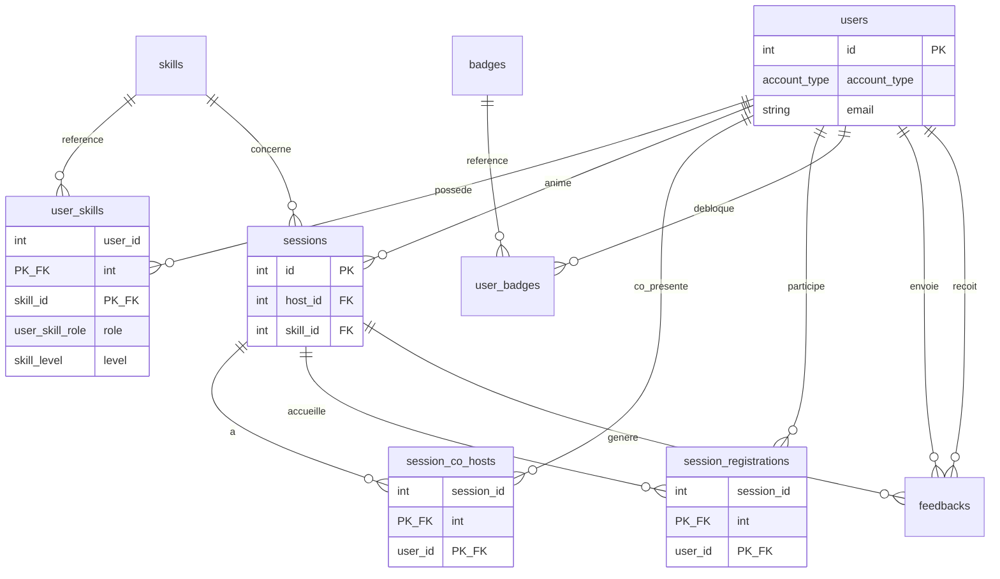

# Dossier de cadrage & technique — SkillSwap

Ce document centralise le résumé des objectifs du workshop, le backlog produit pour Trello, la liste des tâches du développeur et le schéma complet de la base de données.

---

## 1. Résumé des objectifs du workshop

Tu fais partie d'une équipe projet simulant une agence digitale mandatée pour concevoir **SkillSwap**, un site d'échange de compétences entre **étudiants** et **formateurs** sur un même campus.

### Contraintes incontournables

| Domaine | Exigence |
|--------|----------|
| **Gestion de projet** | Utiliser **Trello en mode Scrum** avec un découpage en **3 sprints** (1 sprint par jour de production). |
| **Évolutivité** | Le site doit être pensé dès le départ pour pouvoir devenir une **application mobile** (architecture découplée, choix techniques justifiés). |
| **Rendez-vous clients** | Chaque jour, un point de **5 à 10 min** avec les formateurs (le « client »). Un **compte-rendu (CR) écrit** est obligatoire après chaque échange. |

### Livrables à rendre

**Délai :** fichier `.zip` la veille du **Jour 4**.

| Catégorie | Contenu |
|-----------|---------|
| **Pilotage** | Rôles MOA/MOE, matrice RACI, tableau de charge, rétroplanning, lien Trello et les **3 CR**. |
| **Financier** | Budget estimatif complet (RH avec TJM, hébergement, outils, etc.). |
| **Documentation** | Guide d'usage technique (workflows, déploiement, prérequis) et note écrite sur la gestion des flux de travail entre profils. |
| **Production** | Intégration technique (HTML/CSS, PHP/Symfony ou CMS) **sans passer par Figma**. |

---

## 2. Backlog produit & tâches développeur

Fonctionnalités (user stories) et tâches techniques à intégrer dans la colonne **Backlog** de Trello.

### Epic 1 — Profil & authentification

| ID | Description |
|----|-------------|
| **US 01** | En tant qu'étudiant ou formateur, je veux me connecter avec mon adresse email académique pour garantir un réseau de confiance. |
| **US 02** | En tant qu'utilisateur (étudiant ou formateur), je veux configurer mon profil (compétences, niveaux, disponibilités). |
| **US 01b** | En tant que formateur, je veux un compte dédié (`account_type = Formateur`) distinct des comptes étudiants. |
| **Tâche Dev** | Intégration HTML/CSS responsive et **mobile-first** des pages profil et inscription (choix ou détection du type de compte). |

### Epic 2 — Matching & recherche

| ID | Description |
|----|-------------|
| **US 03** | En tant qu'apprenant, je veux rechercher une compétence par catégories pour trouver le bon interlocuteur. |
| **US 04** | En tant que système, je veux proposer des suggestions de matching automatiques entre étudiants. |
| **Tâche Dev** | Logique de filtrage et d'affichage des compétences en PHP/Symfony ou via CMS. |

### Epic 3 — Gestion des sessions

| ID | Description |
|----|-------------|
| **US 05** | En tant qu'étudiant « enseignant d'un jour » ou **formateur**, je veux créer un atelier ou un cours rapide pour planifier une session. |
| **US 05b** | En tant que **formateur**, je veux me proposer comme **co-présentateur** sur une session existante créée par un autre utilisateur. |
| **US 06** | En tant qu'apprenant (étudiant ou formateur en mode participant), je veux m'inscrire à une session d'apprentissage. |
| **Tâche Dev** | Formulaire de création de session, table `session_co_hosts`, gestion des inscriptions (`session_registrations`) en base de données. |

### Epic 4 — Gamification & social

| ID | Description |
|----|-------------|
| **US 07** | En tant qu'utilisateur, je veux gagner des points et débloquer des badges pour valoriser ma progression. |
| **US 08** | En tant qu'apprenant, je veux laisser un feedback écrit à mon pair après une session. |

### Epic 5 — Gouvernance technique & gestion (obligatoire)

| Jour | Tâche |
|------|--------|
| **Jour 1** | Initialisation du dépôt Git (GitHub/GitLab) et note de justification de la stack technique (évolutivité mobile). |
| **Jour 1** | Fiche d'analyse des besoins en compétences techniques et soft skills. |
| **Jour 2** | Chiffrage du volet technique du budget (coûts matériels, licences, charge en jours, TJM dev). |
| **Jour 3** | Documentation technique d'usage (tutoriel des workflows, procédure de déploiement). |
| **Jour 3** | Note écrite sur la gestion des flux de travail et la résolution des blocages. |

---

## 3. Schéma de la base de données (MPD)

Architecture relationnelle pensée pour être exposée via API afin de faciliter l'évolution future vers l'application mobile.

### A. Types énumérés (enums)

```sql
-- Type de compte sur la plateforme
CREATE TYPE account_type AS ENUM ('Étudiant', 'Formateur');

-- Niveau de maîtrise d'une compétence (sur le profil utilisateur)
CREATE TYPE skill_level AS ENUM ('Débutant', 'Intermédiaire', 'Avancé', 'Expert');

-- Rôle déclaré par l'utilisateur sur une compétence donnée
CREATE TYPE user_skill_role AS ENUM ('Enseignant', 'Apprenant');

-- Statut d'une session d'apprentissage
CREATE TYPE session_status AS ENUM ('Planifiée', 'En cours', 'Terminée', 'Annulée');

-- Type de format de session
CREATE TYPE session_type AS ENUM ('Cours rapide', 'Atelier collectif', 'Club thématique');
```

### B. Règles métier — formateurs

| Règle | Description |
|-------|-------------|
| **Compte formateur** | Même table `users` que les étudiants, distingués par `account_type = 'Formateur'`. |
| **Compétences propres** | Les formateurs renseignent leurs compétences dans `user_skills` (comme les étudiants). |
| **Animer une session** | Un formateur peut être `host_id` d'une session qu'il crée. |
| **Co-présentation** | Un formateur peut rejoindre une session existante via `session_co_hosts` (rôle **co-présentateur**, sans être l'hôte principal). |
| **Participer comme élève** | Un formateur peut s'inscrire à une session via `session_registrations` (même flux que les étudiants). |
| **Exclusivité** | Un même utilisateur ne peut pas être à la fois `host_id`, co-présentateur et inscrit « apprenant » sur la **même** session (contrainte applicative ou trigger). |

### C. Structure des tables

#### Table `users` — Profils étudiants et formateurs

| Champ | Type | Contraintes | Description |
|-------|------|-------------|-------------|
| `id` | INT (PK) | AUTO_INCREMENT | Identifiant unique |
| `account_type` | account_type | NOT NULL, DEFAULT `'Étudiant'` | **Étudiant** ou **Formateur** |
| `first_name` | VARCHAR(50) | NOT NULL | Prénom |
| `last_name` | VARCHAR(50) | NOT NULL | Nom |
| `email` | VARCHAR(100) | NOT NULL, UNIQUE | Email académique obligatoire |
| `password` | VARCHAR(255) | NOT NULL | Mot de passe haché (géré par Supabase Auth en implémentation) |
| `bio` | TEXT | NULL | Biographie / présentation |
| `availabilities` | JSON | NULL | Disponibilités (ex. `{"lundi": ["18h-20h"]}`) |
| `points` | INT | DEFAULT 0 | Points de gamification (étudiants ; optionnel pour formateurs) |
| `created_at` | TIMESTAMP | DEFAULT CURRENT_TIMESTAMP | Date d'inscription |

#### Table `skills` — Référentiel des compétences

| Champ | Type | Contraintes | Description |
|-------|------|-------------|-------------|
| `id` | INT (PK) | AUTO_INCREMENT | Identifiant |
| `name` | VARCHAR(50) | NOT NULL, UNIQUE | Nom (ex. « Développement Web », « Design ») |
| `category` | VARCHAR(50) | NOT NULL | Catégorie (Tech, Sport, Musique, etc.) |

#### Table `user_skills` — Liaison utilisateurs ↔ compétences

> Remplace l'ancienne table `student_skills` : s'applique aux **étudiants** et aux **formateurs**.

| Champ | Type | Contraintes | Description |
|-------|------|-------------|-------------|
| `user_id` | INT (FK) | NOT NULL, composite PK | Référence `users(id)` — ON DELETE CASCADE |
| `skill_id` | INT (FK) | NOT NULL, composite PK | Référence `skills(id)` — ON DELETE CASCADE |
| `role` | user_skill_role | NOT NULL | `Enseignant` (transmettre) ou `Apprenant` (progresser) |
| `level` | skill_level | NOT NULL | Niveau basé sur l'enum `skill_level` |

#### Table `sessions` — Cours et ateliers

| Champ | Type | Contraintes | Description |
|-------|------|-------------|-------------|
| `id` | INT (PK) | AUTO_INCREMENT | Identifiant |
| `title` | VARCHAR(100) | NOT NULL | Titre |
| `description` | TEXT | NOT NULL | Contenu / objectifs |
| `type` | session_type | NOT NULL | Type basé sur l'enum `session_type` |
| `status` | session_status | DEFAULT `'Planifiée'` | Statut basé sur l'enum `session_status` |
| `scheduled_at` | DATETIME | NOT NULL | Date et heure |
| `location` | VARCHAR(255) | NOT NULL | Salle campus ou lien visio |
| `max_participants` | INT | DEFAULT 1 | Nombre max de places (hors animateurs) |
| `host_id` | INT (FK) | NOT NULL | Organisateur principal → `users(id)` (étudiant ou formateur) |
| `skill_id` | INT (FK) | NOT NULL | Compétence → `skills(id)` |

#### Table `session_co_hosts` — Co-présentateurs sur une session

| Champ | Type | Contraintes | Description |
|-------|------|-------------|-------------|
| `session_id` | INT (FK) | NOT NULL, composite PK | Référence `sessions(id)` — ON DELETE CASCADE |
| `user_id` | INT (FK) | NOT NULL, composite PK | Co-présentateur → `users(id)` ; en pratique **formateur** (RLS) |
| `joined_at` | TIMESTAMP | DEFAULT CURRENT_TIMESTAMP | Date d'ajout comme co-présentateur |

**Règles :**

- `user_id` ≠ `sessions.host_id` pour la même `session_id`.
- Un formateur déjà co-présentateur ne peut pas s'inscrire en parallèle via `session_registrations` sur la même session.

#### Table `session_registrations` — Inscriptions participants (apprenants)

| Champ | Type | Contraintes | Description |
|-------|------|-------------|-------------|
| `session_id` | INT (FK) | NOT NULL, composite PK | Référence `sessions(id)` — ON DELETE CASCADE |
| `user_id` | INT (FK) | NOT NULL, composite PK | Participant → `users(id)` (étudiant **ou** formateur en mode apprenant) |
| `registered_at` | TIMESTAMP | DEFAULT CURRENT_TIMESTAMP | Date d'inscription |

> Les **co-présentateurs** ne passent pas par cette table : ils sont listés dans `session_co_hosts`.

#### Table `badges` — Dictionnaire des badges

| Champ | Type | Contraintes | Description |
|-------|------|-------------|-------------|
| `id` | INT (PK) | AUTO_INCREMENT | Identifiant |
| `title` | VARCHAR(50) | NOT NULL, UNIQUE | Nom (ex. « Top Mentor ») |
| `description` | VARCHAR(255) | NOT NULL | Condition d'obtention |
| `icon_url` | VARCHAR(255) | NOT NULL | Chemin vers l'image |

#### Table `user_badges` — Liaison utilisateurs ↔ badges

| Champ | Type | Contraintes | Description |
|-------|------|-------------|-------------|
| `user_id` | INT (FK) | NOT NULL, composite PK | Référence `users(id)` |
| `badge_id` | INT (FK) | NOT NULL, composite PK | Référence `badges(id)` |
| `unlocked_at` | TIMESTAMP | DEFAULT CURRENT_TIMESTAMP | Date d'obtention |

#### Table `feedbacks` — Avis et recommandations

| Champ | Type | Contraintes | Description |
|-------|------|-------------|-------------|
| `id` | INT (PK) | AUTO_INCREMENT | Identifiant |
| `session_id` | INT (FK) | NOT NULL | Référence `sessions(id)` |
| `sender_id` | INT (FK) | NOT NULL | Auteur → `users(id)` |
| `receiver_id` | INT (FK) | NOT NULL | Destinataire → `users(id)` |
| `rating` | INT | NOT NULL | Note de 1 à 5 |
| `comment` | TEXT | NULL | Feedback écrit |
| `created_at` | TIMESTAMP | DEFAULT CURRENT_TIMESTAMP | Date de création |

### D. Diagramme relationnel (synthèse)



### E. Exemples de parcours formateur

| Action | Tables impactées |
|--------|------------------|
| Créer son profil formateur | `users` (`account_type = Formateur`), `user_skills` |
| Lancer une session | `sessions` (`host_id` = formateur) |
| Rejoindre en co-présentateur | `session_co_hosts` (insert si pas déjà hôte) |
| Assister comme un élève | `session_registrations` (même règles `max_participants`) |
