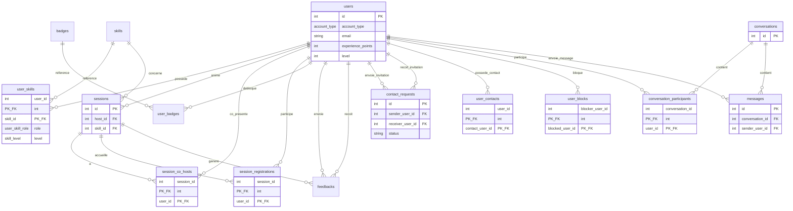

# Dossier de cadrage & technique — SkillSwap

Ce document centralise le résumé des objectifs du workshop, le backlog produit pour Trello, la liste des tâches du développeur et le schéma complet de la base de données.

---

## 1. Résumé des objectifs du workshop

Tu fais partie d'une équipe projet simulant une agence digitale mandatée pour concevoir **SkillSwap**, un site d'échange de compétences entre **étudiants** et **formateurs** sur un même campus.

### Contraintes incontournables

| Domaine | Exigence |
|--------|----------|
| **Gestion de projet** | Utiliser **Trello en mode Scrum** avec un découpage en **3 sprints** (1 sprint par jour de production). |
| **Évolutivité** | Le site doit être pensé dès le départ pour pouvoir devenir une **application mobile** (architecture découplée, choix techniques justifiés). |
| **Rendez-vous clients** | Chaque jour, un point de **5 à 10 min** avec les formateurs (le « client »). Un **compte-rendu (CR) écrit** est obligatoire après chaque échange. |

### Livrables à rendre

**Délai :** fichier `.zip` la veille du **Jour 4**.

| Catégorie | Contenu |
|-----------|---------|
| **Pilotage** | Rôles MOA/MOE, matrice RACI, tableau de charge, rétroplanning, lien Trello et les **3 CR**. |
| **Financier** | Budget estimatif complet (RH avec TJM, hébergement, outils, etc.). |
| **Documentation** | Guide d'usage technique (workflows, déploiement, prérequis) et note écrite sur la gestion des flux de travail entre profils. |
| **Production** | Intégration technique (HTML/CSS, PHP/Symfony ou CMS) **sans passer par Figma**. |

---

## 2. Backlog produit & tâches développeur

Fonctionnalités (user stories) et tâches techniques à intégrer dans la colonne **Backlog** de Trello.

### Epic 1 — Compte & Authentification

| ID | Description | Priorité | Persona |
|----|-------------|----------|---------|
| **US 01** | En tant qu'utilisateur, je souhaite créer un compte pour accéder à la plateforme. | Haute | Apprenant, Mentor |

**Critères d'acceptation US 01**
- Inscription avec email et mot de passe
- Validation d'email
- Connexion / Déconnexion sécurisée

### Epic 2 — Recherche

| ID | Description | Priorité | Persona |
|----|-------------|----------|---------|
| **US 02** | En tant qu'étudiant, je souhaite rechercher une compétence ou un mentor afin de trouver la personne qui peut m'aider. | Haute | Apprenant |

**Critères d'acceptation US 02**
- Recherche par mot-clé
- Filtres (compétence, niveau, disponibilité)
- Affichage des résultats pertinents

### Epic 3 — Sessions & Réservation

| ID | Description | Priorité | Persona |
|----|-------------|----------|---------|
| **US 03** | En tant qu'utilisateur, je souhaite réserver une session avec un mentor afin d'apprendre une compétence. | Haute | Apprenant |

**Critères d'acceptation US 03**
- Voir les disponibilités du mentor
- Réserver une session (date / heure)
- Recevoir une confirmation
- Gérer ou annuler une réservation

### Epic 4 — Profil & Compétences

| ID | Description | Priorité | Persona |
|----|-------------|----------|---------|
| **US 04** | En tant qu'utilisateur, je souhaite créer et modifier mon profil afin de présenter mes compétences et mon parcours. | Haute | Apprenant, Mentor |

**Critères d'acceptation US 04**
- Ajout photo, bio, formation
- Ajout / modification des compétences
- Indiquer son niveau et ses disponibilités
- Voir son profil public

### Epic 5 — Messagerie & Communication

| ID | Description | Priorité | Persona |
|----|-------------|----------|---------|
| **US 05** | En tant qu'utilisateur, je souhaite discuter avec d'autres membres afin de poser des questions ou organiser une session. | Moyenne | Apprenant, Mentor |

**Critères d'acceptation US 05**
- Envoyer et recevoir des messages
- Historique des conversations
- Notifications lors d'un message reçu
- Liste de contacts privée (contacts ajoutés uniquement après invitation + acceptation)
- Envoyer / accepter / refuser une invitation de contact
- Bloquer un utilisateur (retire le contact et empêche l'envoi de nouveaux messages)

### Epic 6 — Publications & Partage

| ID | Description | Priorité | Persona |
|----|-------------|----------|---------|
| **US 06** | En tant qu'utilisateur, je souhaite publier du contenu (articles, conseils, projets) afin de partager mes connaissances. | Moyenne | Mentor |

**Critères d'acceptation US 06**
- Créer une publication (texte, image, lien)
- Liker / commenter / partager
- Voir le fil d'actualité

### Epic 7 — Badges & Gamification

| ID | Description | Priorité | Persona |
|----|-------------|----------|---------|
| **US 07** | En tant qu'utilisateur, je souhaite gagner des badges pour être reconnu pour mon implication et mes compétences. | Moyenne | Apprenant, Mentor |

**Critères d'acceptation US 07**
- Obtenir des badges selon l'activité
- Voir ses badges sur son profil
- Suivre son expérience (XP), son niveau et la progression vers le niveau suivant
- Le niveau 1 démarre à 0 XP ; il faut 500 XP pour passer au niveau 2, puis le seuil augmente de 500 XP à chaque niveau (niveau 2 → 3 : 1000 XP, niveau 3 → 4 : 1500 XP, etc.)

### Epic 8 — Administration & Modération

| ID | Description | Priorité | Persona |
|----|-------------|----------|---------|
| **US 08** | En tant qu'administrateur, je souhaite modérer les contenus et les utilisateurs afin de garantir un environnement sain. | Basse | Administrateur |

**Critères d'acceptation US 08**
- Signaler un contenu ou un utilisateur
- Modérer / supprimer un contenu
- Gérer les utilisateurs et les rôles

### Epic 9 — Statistiques

| ID | Description | Priorité | Persona |
|----|-------------|----------|---------|
| **US 09** | En tant qu'administrateur, je souhaite consulter des statistiques d'utilisation afin de suivre l'activité de la plateforme. | Basse | Administrateur |

**Critères d'acceptation US 09**
- Voir le nombre d'utilisateurs actifs
- Voir les sessions créées / réservées
- Voir les compétences les plus recherchées

### Epic 5 — Gouvernance technique & gestion (obligatoire)

| Jour | Tâche |
|------|--------|
| **Jour 1** | Initialisation du dépôt Git (GitHub/GitLab) et note de justification de la stack technique (évolutivité mobile). |
| **Jour 1** | Fiche d'analyse des besoins en compétences techniques et soft skills. |
| **Jour 2** | Chiffrage du volet technique du budget (coûts matériels, licences, charge en jours, TJM dev). |
| **Jour 3** | Documentation technique d'usage (tutoriel des workflows, procédure de déploiement). |
| **Jour 3** | Note écrite sur la gestion des flux de travail et la résolution des blocages. |

---

## 3. Schéma de la base de données (MPD)

Architecture relationnelle pensée pour être exposée via API afin de faciliter l'évolution future vers l'application mobile.

### A. Types énumérés (enums)

```sql
-- Type de compte sur la plateforme
CREATE TYPE account_type AS ENUM ('Étudiant', 'Formateur');

-- Niveau de maîtrise d'une compétence (sur le profil utilisateur)
CREATE TYPE skill_level AS ENUM ('Débutant', 'Intermédiaire', 'Avancé', 'Expert');

-- Rôle déclaré par l'utilisateur sur une compétence donnée
CREATE TYPE user_skill_role AS ENUM ('Enseignant', 'Apprenant');

-- Statut d'une session d'apprentissage
CREATE TYPE session_status AS ENUM ('Planifiée', 'En cours', 'Terminée', 'Annulée');

-- Type de format de session
CREATE TYPE session_type AS ENUM ('Cours rapide', 'Atelier collectif', 'Club thématique');
```

### B. Règles métier — formateurs

| Règle | Description |
|-------|-------------|
| **Compte formateur** | Même table `users` que les étudiants, distingués par `account_type = 'Formateur'`. |
| **Compétences propres** | Les formateurs renseignent leurs compétences dans `user_skills` (comme les étudiants). |
| **Animer une session** | Un formateur peut être `host_id` d'une session qu'il crée. |
| **Co-présentation** | Un formateur peut rejoindre une session existante via `session_co_hosts` (rôle **co-présentateur**, sans être l'hôte principal). |
| **Participer comme élève** | Un formateur peut s'inscrire à une session via `session_registrations` (même flux que les étudiants). |
| **Exclusivité** | Un même utilisateur ne peut pas être à la fois `host_id`, co-présentateur et inscrit « apprenant » sur la **même** session (contrainte applicative ou trigger). |

### C. Structure des tables

#### Table `users` — Profils étudiants et formateurs

| Champ | Type | Contraintes | Description |
|-------|------|-------------|-------------|
| `id` | INT (PK) | AUTO_INCREMENT | Identifiant unique |
| `account_type` | account_type | NOT NULL, DEFAULT `'Étudiant'` | **Étudiant** ou **Formateur** |
| `first_name` | VARCHAR(50) | NOT NULL | Prénom |
| `last_name` | VARCHAR(50) | NOT NULL | Nom |
| `email` | VARCHAR(100) | NOT NULL, UNIQUE | Email académique obligatoire |
| `password` | VARCHAR(255) | NOT NULL | Mot de passe haché (géré par Supabase Auth en implémentation) |
| `bio` | TEXT | NULL | Biographie / présentation |
| `availabilities` | JSON | NULL | Disponibilités (ex. `{"lundi": ["18h-20h"]}`) |
| `experience_points` | INT | DEFAULT 0 | XP cumulée de gamification (étudiants ; optionnel pour formateurs) |
| `level` | INT | DEFAULT 1 | Niveau public du profil, calculé à partir de l'XP |
| `created_at` | TIMESTAMP | DEFAULT CURRENT_TIMESTAMP | Date d'inscription |

**Règle de progression niveau / expérience :**

- Un utilisateur commence au `level = 1` avec `experience_points = 0`.
- Le passage du niveau 1 au niveau 2 demande **500 XP**.
- Chaque niveau ajoute **+500 XP** au seuil de montée : niveau 2 → 3 = **1000 XP**, niveau 3 → 4 = **1500 XP**, etc.
- La formule du seuil pour passer du niveau `n` au niveau `n + 1` est : `n * 500 XP`.
- Les actions de gamification (session terminée, session animée, badge obtenu, feedback utile) ajoutent de l'XP ; une Edge Function ou un trigger met à jour `level` quand un seuil est atteint.

#### Table `skills` — Référentiel des compétences

| Champ | Type | Contraintes | Description |
|-------|------|-------------|-------------|
| `id` | INT (PK) | AUTO_INCREMENT | Identifiant |
| `name` | VARCHAR(50) | NOT NULL, UNIQUE | Nom (ex. « Développement Web », « Design ») |
| `category` | VARCHAR(50) | NOT NULL | Catégorie (Tech, Sport, Musique, etc.) |

#### Table `user_skills` — Liaison utilisateurs ↔ compétences

> Remplace l'ancienne table `student_skills` : s'applique aux **étudiants** et aux **formateurs**.

| Champ | Type | Contraintes | Description |
|-------|------|-------------|-------------|
| `user_id` | INT (FK) | NOT NULL, composite PK | Référence `users(id)` — ON DELETE CASCADE |
| `skill_id` | INT (FK) | NOT NULL, composite PK | Référence `skills(id)` — ON DELETE CASCADE |
| `role` | user_skill_role | NOT NULL | `Enseignant` (transmettre) ou `Apprenant` (progresser) |
| `level` | skill_level | NOT NULL | Niveau basé sur l'enum `skill_level` |

#### Table `sessions` — Cours et ateliers

| Champ | Type | Contraintes | Description |
|-------|------|-------------|-------------|
| `id` | INT (PK) | AUTO_INCREMENT | Identifiant |
| `title` | VARCHAR(100) | NOT NULL | Titre |
| `description` | TEXT | NOT NULL | Contenu / objectifs |
| `type` | session_type | NOT NULL | Type basé sur l'enum `session_type` |
| `status` | session_status | DEFAULT `'Planifiée'` | Statut basé sur l'enum `session_status` |
| `scheduled_at` | DATETIME | NOT NULL | Date et heure |
| `location` | VARCHAR(255) | NOT NULL | Salle campus ou lien visio |
| `max_participants` | INT | DEFAULT 1 | Nombre max de places (hors animateurs) |
| `host_id` | INT (FK) | NOT NULL | Organisateur principal → `users(id)` (étudiant ou formateur) |
| `skill_id` | INT (FK) | NOT NULL | Compétence → `skills(id)` |

#### Table `session_co_hosts` — Co-présentateurs sur une session

| Champ | Type | Contraintes | Description |
|-------|------|-------------|-------------|
| `session_id` | INT (FK) | NOT NULL, composite PK | Référence `sessions(id)` — ON DELETE CASCADE |
| `user_id` | INT (FK) | NOT NULL, composite PK | Co-présentateur → `users(id)` ; en pratique **formateur** (RLS) |
| `joined_at` | TIMESTAMP | DEFAULT CURRENT_TIMESTAMP | Date d'ajout comme co-présentateur |

**Règles :**

- `user_id` ≠ `sessions.host_id` pour la même `session_id`.
- Un formateur déjà co-présentateur ne peut pas s'inscrire en parallèle via `session_registrations` sur la même session.

#### Table `session_registrations` — Inscriptions participants (apprenants)

| Champ | Type | Contraintes | Description |
|-------|------|-------------|-------------|
| `session_id` | INT (FK) | NOT NULL, composite PK | Référence `sessions(id)` — ON DELETE CASCADE |
| `user_id` | INT (FK) | NOT NULL, composite PK | Participant → `users(id)` (étudiant **ou** formateur en mode apprenant) |
| `registered_at` | TIMESTAMP | DEFAULT CURRENT_TIMESTAMP | Date d'inscription |

> Les **co-présentateurs** ne passent pas par cette table : ils sont listés dans `session_co_hosts`.

#### Table `badges` — Dictionnaire des badges

| Champ | Type | Contraintes | Description |
|-------|------|-------------|-------------|
| `id` | INT (PK) | AUTO_INCREMENT | Identifiant |
| `title` | VARCHAR(50) | NOT NULL, UNIQUE | Nom (ex. « Top Mentor ») |
| `description` | VARCHAR(255) | NOT NULL | Condition d'obtention |
| `icon_url` | VARCHAR(255) | NOT NULL | Chemin vers l'image |

#### Table `user_badges` — Liaison utilisateurs ↔ badges

| Champ | Type | Contraintes | Description |
|-------|------|-------------|-------------|
| `user_id` | INT (FK) | NOT NULL, composite PK | Référence `users(id)` |
| `badge_id` | INT (FK) | NOT NULL, composite PK | Référence `badges(id)` |
| `unlocked_at` | TIMESTAMP | DEFAULT CURRENT_TIMESTAMP | Date d'obtention |

#### Table `feedbacks` — Avis et recommandations

| Champ | Type | Contraintes | Description |
|-------|------|-------------|-------------|
| `id` | INT (PK) | AUTO_INCREMENT | Identifiant |
| `session_id` | INT (FK) | NOT NULL | Référence `sessions(id)` |
| `sender_id` | INT (FK) | NOT NULL | Auteur → `users(id)` |
| `receiver_id` | INT (FK) | NOT NULL | Destinataire → `users(id)` |
| `rating` | INT | NOT NULL | Note de 1 à 5 |
| `comment` | TEXT | NULL | Feedback écrit |
| `created_at` | TIMESTAMP | DEFAULT CURRENT_TIMESTAMP | Date de création |

#### Table `contact_requests` — Invitations de contact

| Champ | Type | Contraintes | Description |
|-------|------|-------------|-------------|
| `id` | INT (PK) | AUTO_INCREMENT | Identifiant unique de l'invitation |
| `sender_user_id` | INT (FK) | NOT NULL | Utilisateur qui envoie l'invitation |
| `receiver_user_id` | INT (FK) | NOT NULL | Utilisateur qui reçoit l'invitation |
| `status` | VARCHAR(20) | NOT NULL, DEFAULT `'pending'` | `pending`, `accepted`, `rejected`, `cancelled` |
| `created_at` | TIMESTAMP | DEFAULT CURRENT_TIMESTAMP | Date d'envoi |
| `responded_at` | TIMESTAMP | NULL | Date de réponse |

**Règles :**

- `sender_user_id` doit être différent de `receiver_user_id`.
- Une seule invitation active (`pending`) par paire d'utilisateurs.
- Une invitation ne peut pas être créée si un blocage existe entre les deux utilisateurs.

#### Table `user_contacts` — Contacts acceptés (liste privée)

| Champ | Type | Contraintes | Description |
|-------|------|-------------|-------------|
| `user_id` | INT (FK) | NOT NULL, composite PK | Propriétaire de la liste |
| `contact_user_id` | INT (FK) | NOT NULL, composite PK | Utilisateur présent dans la liste de contacts |
| `created_at` | TIMESTAMP | DEFAULT CURRENT_TIMESTAMP | Date d'ajout du contact |

**Règles :**

- Une ligne est créée uniquement après acceptation d'une invitation.
- L'acceptation crée deux lignes (relation réciproque): A→B et B→A.
- La liste est privée: lecture autorisée uniquement au propriétaire (`user_id`).

#### Table `user_blocks` — Blocages entre utilisateurs

| Champ | Type | Contraintes | Description |
|-------|------|-------------|-------------|
| `blocker_user_id` | INT (FK) | NOT NULL, composite PK | Utilisateur qui bloque |
| `blocked_user_id` | INT (FK) | NOT NULL, composite PK | Utilisateur bloqué |
| `created_at` | TIMESTAMP | DEFAULT CURRENT_TIMESTAMP | Date de blocage |

**Règles :**

- `blocker_user_id` doit être différent de `blocked_user_id`.
- Au blocage, retirer les deux entrées éventuelles dans `user_contacts`.
- Au blocage, refuser tout nouvel envoi de message ou invitation entre les deux utilisateurs.

#### Table `conversations` — Discussions privées

| Champ | Type | Contraintes | Description |
|-------|------|-------------|-------------|
| `id` | INT (PK) | AUTO_INCREMENT | Identifiant de conversation |
| `created_at` | TIMESTAMP | DEFAULT CURRENT_TIMESTAMP | Date de création |

#### Table `conversation_participants` — Participants des conversations

| Champ | Type | Contraintes | Description |
|-------|------|-------------|-------------|
| `conversation_id` | INT (FK) | NOT NULL, composite PK | Conversation |
| `user_id` | INT (FK) | NOT NULL, composite PK | Participant |
| `joined_at` | TIMESTAMP | DEFAULT CURRENT_TIMESTAMP | Date d'ajout |

#### Table `messages` — Messages échangés

| Champ | Type | Contraintes | Description |
|-------|------|-------------|-------------|
| `id` | INT (PK) | AUTO_INCREMENT | Identifiant message |
| `conversation_id` | INT (FK) | NOT NULL | Conversation cible |
| `sender_user_id` | INT (FK) | NOT NULL | Auteur du message |
| `content` | TEXT | NOT NULL | Contenu du message |
| `created_at` | TIMESTAMP | DEFAULT CURRENT_TIMESTAMP | Date d'envoi |
| `is_deleted` | BOOLEAN | NOT NULL, DEFAULT `false` | Suppression logique côté application |

**Règles :**

- `sender_user_id` doit appartenir à `conversation_participants`.
- Interdire l'insertion d'un message si un blocage existe entre participants concernés.
- Pour une messagerie 1:1, une conversation contient exactement 2 participants.

### D. Diagramme relationnel (synthèse)



### E. Exemples de parcours formateur

| Action | Tables impactées |
|--------|------------------|
| Créer son profil formateur | `users` (`account_type = Formateur`), `user_skills` |
| Lancer une session | `sessions` (`host_id` = formateur) |
| Rejoindre en co-présentateur | `session_co_hosts` (insert si pas déjà hôte) |
| Assister comme un élève | `session_registrations` (même règles `max_participants`) |
